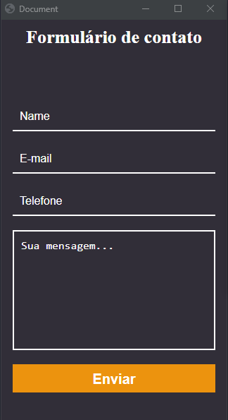
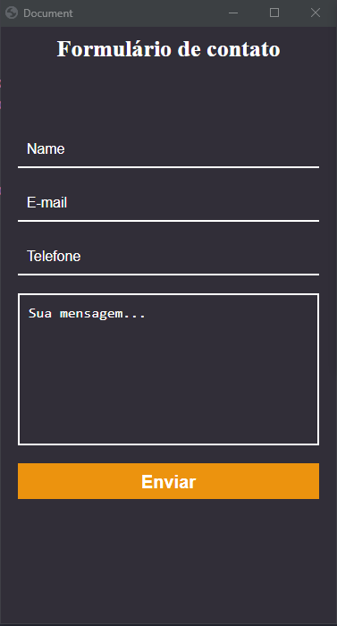

# Envio de e-mail

Para rodar o projeto.

Para subir os contêineres.

```bash
docker-compose up -d
```

Para deletar os contêineres.

```bash
docker-compose down
```

---

> Envio de e-mail com node e nodemailer.


**Biblioteca que usei para template do e-mail.**

handlebars:

```bash
yarn add express-handlebars nodemailer-express-handlebars
```

# Mobile




